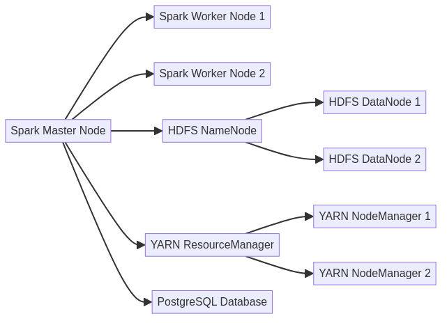
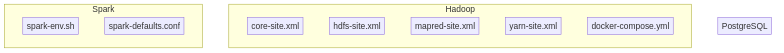
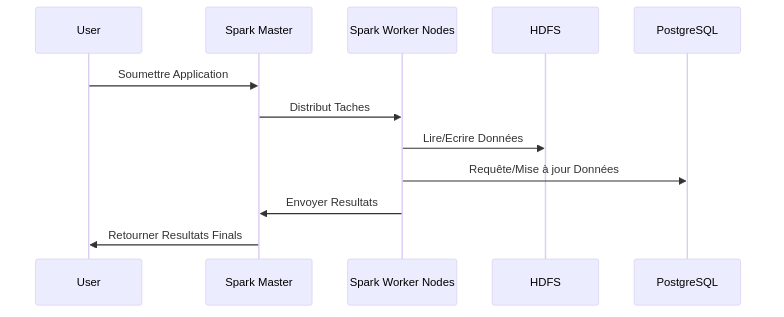
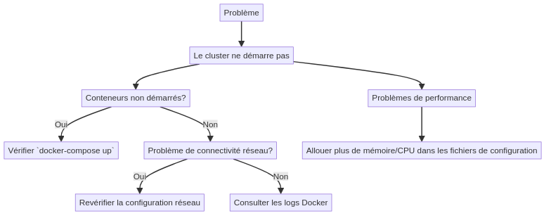

# Cluster Hadoop, Spark, et PostgreSQL avec Application SBT

## Table des Matières

- [Introduction](#introduction)
- [Prérequis](#prérequis)
- [Téléchargement des Datasets](#téléchargement-des-datasets)
- [Architecture du Cluster](#architecture-du-cluster)
- [Configuration du Cluster](#configuration-du-cluster)
  - [Configuration Hadoop](#configuration-hadoop)
  - [Configuration Spark](#configuration-spark)
  - [Configuration PostgreSQL](#configuration-postgresql)
- [Construction de l'Application SBT](#construction-de-lapplication-sbt)
- [Déploiement du Cluster](#déploiement-du-cluster)
- [Exécution de l'Application SBT](#exécution-de-lapplication-sbt)
- [Surveillance et Gestion](#surveillance-et-gestion)
- [Résolution des Problèmes](#résolution-des-problèmes)

## Introduction

Ce projet vise à déployer un cluster distribué combinant Hadoop, Spark, et PostgreSQL, permettant de traiter de grandes quantités de données de manière distribuée et efficace. L'objectif est de démontrer comment une application Scala construite avec SBT peut être déployée sur ce cluster et interagir avec tous les composants.
L'application principale, **DataFusionPipeline**, est une application Scala/SBT qui tire parti de cette infrastructure pour intégrer et analyser des données provenant de diverses sources.

## Environnement

L'environnement de développement et de production repose sur les composants suivants :

- **Docker** : Utilisé pour conteneuriser l'ensemble des services (Hadoop, Spark, PostgreSQL, SBT) afin de garantir une portabilité et une isolation parfaites.
- **Red Hat Universal Base Image 8** : Base d'image Docker pour assurer la compatibilité et la sécurité.
- **Hadoop 3.3.6** : Framework distribué pour le stockage et le traitement de grandes quantités de données via HDFS.
- **Spark 2.4.7** : Moteur de traitement de données en mémoire pour des analyses rapides et distribuées.
- **PostgreSQL 15.7** : Base de données relationnelle utilisée pour le stockage persistant des résultats analytiques.
- **SBT 1.8.3** : Outil de build pour la gestion des dépendances et la compilation de l'application Scala.

## Prérequis

Avant de commencer, assurez-vous d'avoir installé les outils suivants :

- **Docker** : Pour la conteneurisation des services.
- **Docker Compose** : Pour la gestion des services multi-conteneurs.
- **SBT (Scala Build Tool)** : Pour compiler et construire l'application Scala.
- **Java (JDK 8 ou version supérieure)** : Pour exécuter les services Hadoop et Spark.
- **Compte Kaggle** pour télécharger les datasets.

## Téléchargement des Datasets

### Inscription et Configuration Kaggle

1. **Inscription à Kaggle** :
   - Si vous n'avez pas encore de compte Kaggle, inscrivez-vous sur [kaggle.com](https://www.kaggle.com).

2. **API Kaggle** :
   - Pour télécharger les datasets via l'API Kaggle, vous devez générer une clé API :
     - Allez dans votre profil Kaggle.
     - Cliquez sur "Account" et faites défiler jusqu'à la section "API".
     - Cliquez sur "Create New API Token". Un fichier `kaggle.json` sera téléchargé.

3. **Configuration de l'API Kaggle** :
   - Placez le fichier `kaggle.json` dans le répertoire `~/.kaggle/` de votre host sous Linux (ou `%USERPROFILE%/.kaggle/` sous Windows).

### Préparation des datasets

Les datasets utilisés dans ce projet sont disponibles sur Kaggle. Pour les télécharger :

1. **Accédez au répertoire `datasets/`** dans le projet.

2. **Exécutez les commandes suivantes** pour télécharger les datasets :

   ```bash
   # Téléchargement des transactions de vente
   kaggle datasets download -d mashlyn/online-retail-ii-uci
   unzip online-retail-ii-uci.zip
   rm online-retail-ii-uci.zip
   
   # Téléchargement des données démographiques des clients
   kaggle datasets download -d arjunbhasin2013/ccdata
   unzip ccdata.zip
   mv "CC GENERAL.csv" ccdata.csv
   rm ccdata.zip
   
   # Téléchargement des informations sur les produits
   kaggle datasets download -d promptcloud/amazon-product-listing-data
   unzip amazon-product-listing-data.zip
   mv "marketing_sample_for_amazon_com-amazon_com_product__20210401_20210430__30k_data.csv" amazon-product-listing-data.csv
   rm amazon-product-listing-data.zip

3. **Organisation des Fichiers** :

    - Les fichiers téléchargés doivent être placés dans le répertoire datasets/ :
      datasets
      ├── amazon-product-listing-data.csv
      ├── ccdata.csv
      └── online_retail_II.csv

## Architecture du Cluster

Le cluster est composé des éléments suivants :

1. **Nœud Master Spark** : Gère les tâches, les ressources, et supervise les nœuds workers.
2. **Nœuds Workers Spark** : Exécutent les tâches distribuées.
3. **HDFS (Hadoop Distributed File System)** : Fournit un système de fichiers distribué pour le stockage des données.
4. **YARN (Yet Another Resource Negotiator)** : Gère les ressources de calcul dans le cluster.
5. **PostgreSQL** : Sert de base de données relationnelle pour le stockage des données persistantes.

### Schéma de l'Architecture



Ce diagramme montre comment les composants interagissent entre eux, avec Spark en tant que moteur de calcul distribué supervisé par YARN, utilisant HDFS pour le stockage des données, et PostgreSQL pour la gestion des données relationnelles.

## Configuration du Cluster

La configuration du cluster est assurée via différents fichiers de configuration pour chaque composant.

### Configuration Hadoop

Les fichiers de configuration Hadoop sont situés dans le répertoire `config/hadoop/` et incluent :

- **core-site.xml** : Définir le système de fichiers distribué (HDFS) par défaut et le répertoire temporaire de Hadoop.
- **hdfs-site.xml** : Configurer le répertoire des métadonnées et des données de HDFS ainsi que la réplication des blocs.
- **mapred-site.xml** : Configurer l'exécution de MapReduce via YARN.
- **yarn-site.xml** : Définir les paramètres de gestion des ressources par YARN.

Voici un exemple de configuration pour `core-site.xml` :

```xml
<configuration>
  <property>
    <name>fs.defaultFS</name>
    <value>hdfs://master-namenode:9000</value>
  </property>
  <property>
    <name>hadoop.tmp.dir</name>
    <value>/usr/local/hadoop/tmp</value>
  </property>
</configuration>
```

### Configuration Spark

Les fichiers de configuration Spark se trouvent dans le répertoire `config/spark/`.

- **spark-env.sh** : Définit les variables d'environnement essentielles pour Spark.
- **spark-defaults.conf** : Contient les paramètres par défaut pour les applications Spark.
- **YARN** : Mettre les jars dans hdfs pour le partager avec tous les noeuds du cluster
    docker exec -it master-namenode bash
    hdfs dfs -mkdir -p /user/hadoopuser/spark-jars
    hdfs dfs -mkdir -p /user/hadoopuser/spark-logs
    hdfs dfs -chmod 775 /user/hadoopuser/spark-logs
    hdfs dfs -chmod 775 /user/hadoopuser/spark-jars

    hdfs dfs -put $SPARK_HOME/jars/*.jar /user/hadoopuser/spark-jars/

### Configuration PostgreSQL

PostgreSQL est configuré via des variables d'environnement dans le fichier `docker-compose.yml` et `.env`.

### Diagramme de Configuration

Vous pouvez ajouter un diagramme illustrant la structure des fichiers de configuration et leur rôle dans le cluster.



## Construction de l'Application SBT

L'application SBT est définie dans le fichier `build.sbt`. Pour compiler et assembler l'application, exécutez la commande suivante :

```bash
sbt clean compile assembly
```

### Aperçu du Fichier `build.sbt`

```scala
name := "DataFusionPipeline"

version := "1.0"

scalaVersion := "2.11.8"

libraryDependencies ++= Seq(
  "org.apache.spark" %% "spark-core" % "2.4.7",
  "org.apache.spark" %% "spark-sql" % "2.4.7",
  "org.scalatest" %% "scalatest" % "3.0.5" % Test,
  "org.apache.spark" %% "spark-mllib" % "2.4.7",
  "org.postgresql" % "postgresql" % "42.3.1"
)

testOptions in Test += Tests.Argument(TestFrameworks.ScalaTest, "-oD")
```

Le fichier JAR résultant sera situé dans le répertoire `<repertoire d'installation de sbt>target/scala-2.12/`.

## Déploiement du Cluster

Pour déployer le cluster, utilisez Docker Compose :

```bash
docker-compose up --build
```

- **Interface Web de Spark** : `http://localhost:8080`
- **Interface Web de HDFS** : `http://localhost:9870`
- **PostgreSQL** : Connexion via un client à `localhost:5432`.

## Ingestion des datasets dans HDFS**

- docker cp datasets master-namenode:/datasets
- Tous les commandes restantes se feront dans le container master-namenode
- On y accède avec cette commande : docker exec -it master-namenode bash

1. **Creation du dossier HDFS des datasets pour l'utilisateur par défaut**
    - hdfs dfs -mkdir -p /user/hadoopuser/datasets

2. **Ingestion des datasets dans HDFS**
    - hdfs dfs -put /datasets/online_retail_II.csv /user/hadoopuser/datasets/
    - hdfs dfs -put /datasets/ccdata.csv /user/hadoopuser/datasets/
    - hdfs dfs -put /datasets/amazon-product-listing-data.csv /user/hadoopuser/datasets/

## Exécution de l'Application SBT

Une fois le cluster déployé, vous pouvez soumettre l'application SBT à Spark :

Voir le README de l'application SBT

### Diagramme d'Exécution

Diagramme illustrant le flux de travail de l'exécution de l'application depuis l'envoi à Spark jusqu'à l'interaction avec HDFS et PostgreSQL.



## Surveillance et Gestion

- **Surveillance des Tâches** : Utilisez l'interface Web de Spark pour surveiller les tâches en cours.
- **Gestion des Journaux** : Consultez les journaux dans HDFS ou via l'interface Web de Spark pour diagnostiquer les problèmes.

## Résolution des Problèmes

- **Problèmes de Connectivité** : Assurez-vous que tous les conteneurs sont correctement reliés au même réseau Docker.
- **Problèmes de Performance** : Ajustez les ressources allouées (mémoire, CPU) dans les fichiers de configuration de Spark et YARN.
- **Logs et Diagnostics** : Vérifiez les journaux d'erreurs dans `/var/log/spark/` et `/var/log/hadoop/` dans les conteneurs.

### Diagramme de Dépannage

Un diagramme d'arbre décisionnel pour la résolution des problèmes courants pourrait être utile.


