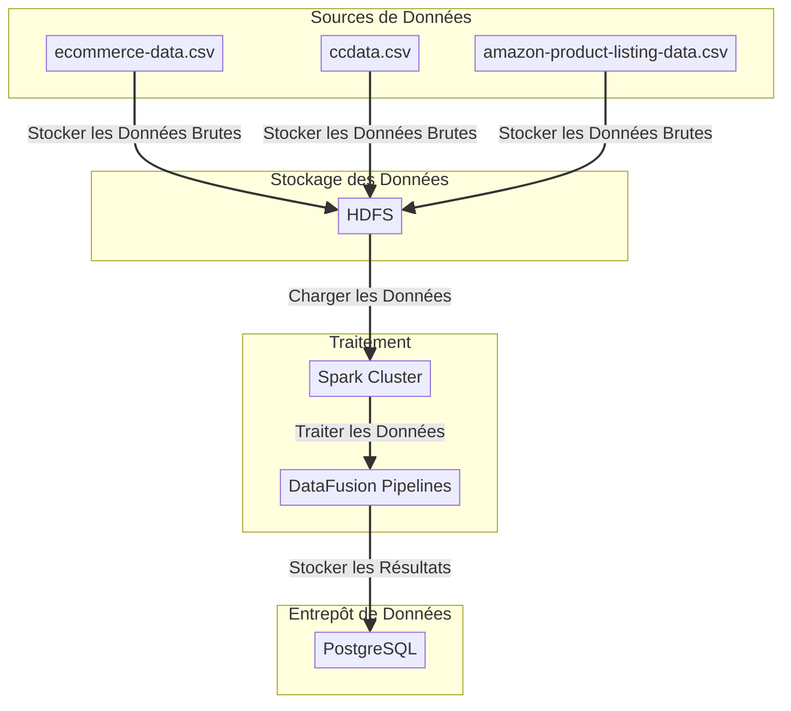
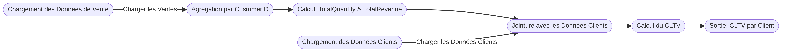
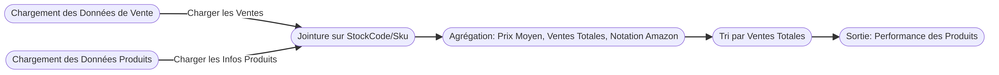

# DataFusionPipeline

## Introduction

**DataFusionPipeline** est une application Scala construite avec SBT, conçue pour exécuter une série de pipelines de traitement de données sur un cluster Hadoop/Spark. Cette application intègre des données provenant de différentes sources, les transforme, les enrichit, et stocke les résultats dans une base de données PostgreSQL pour une analyse avancée. En utilisant les capacités de traitement distribué de Spark et le stockage persistant de PostgreSQL, **DataFusionPipeline** permet d'analyser de grands volumes de données en temps réel, garantissant des insights rapides et précis pour des prises de décision informées.

## Architecture du Système

Voici un schéma représentant l'architecture globale du système. Cette architecture est conçue pour assurer une gestion efficace du flux de données depuis l'ingestion jusqu'à l'analyse :



### Composants Principaux

- **Hadoop** : Stocke les données brutes sur HDFS, assurant la fiabilité et la redondance des données.
- **Spark** : Traite les données en mémoire pour des performances accrues, en exécutant les pipelines de transformation et d'analyse.
- **PostgreSQL** : Sert de base de données pour stocker les résultats des analyses, permettant une interrogation rapide et l'intégration avec d'autres outils analytiques.

## Environnement

L'application s'exécute dans un environnement distribué utilisant :

- **Hadoop** : Pour le stockage distribué via HDFS.
- **Spark** : Pour le traitement des données en mémoire et en temps réel.
- **PostgreSQL** : Pour le stockage persistant des résultats analytiques.
- **SBT** : Pour la gestion des dépendances, la compilation et l'exécution de l'application Scala.

## Prérequis

Avant de commencer, assurez-vous que les outils suivants sont installés et configurés :

- **Hadoop 3.x** installé et configuré.
- **Spark 2.4.x** installé et configuré avec YARN.
- **PostgreSQL 15.x** installé et accessible.
- **SBT 1.8.x** installé pour la compilation du projet.

## Configuration

### Variables d'Environnement

Les variables d'environnement suivantes peuvent être configurées dans votre système ou dans les fichiers de configuration :

- **SCALA_VERSION** : Version de Scala à utiliser (par défaut : `2.11.8`).
- **SPARK_VERSION** : Version de Spark à utiliser (par défaut : `2.4.7`).
- **HADOOP_VERSION** : Version de Hadoop (par défaut : `3.3.6`).
- **POSTGRES_VERSION** : Version du pilote PostgreSQL (par défaut : `15.7` | JDBC `42.3.1`).

### Configuration des Variables d'Environnement

Les variables d'environnement sont définies dans le fichier de configuration de l'application `application.conf`.

### Build SBT

Le fichier `build.sbt` définit les dépendances et les paramètres de compilation pour l'application. Le plugin Assembly est utilisé pour créer un JAR exécutable contenant toutes les dépendances.

### Entrypoint

Le script `entrypoint.sh` est utilisé pour initialiser tous les services nécessaires avant l'exécution de l'application. Ce script s'occupe du démarrage de PostgreSQL, du formatage et du démarrage de HDFS, ainsi que du lancement de YARN et Spark, assurant que l'environnement est prêt pour le traitement des données.

## Utilisation

### Compilation

```bash
sbt clean compile
```

### Création du JAR

```bash
sbt assembly
```

### Exécution

L'application peut être exécutée sur un cluster Spark en utilisant `spark-submit` :

```bash
docker exec -it master-namenode /usr/local/spark/bin/spark-submit --class com.datafusion.Main --master yarn --deploy-mode cluster target/scala-2.11/DataFusionPipeline-assembly-1.0.jar

## Ou

spark-submit --class com.datafusion.Main --master yarn --deploy-mode cluster target/scala-2.11/DataFusionPipeline-assembly-1.0.jar
```

### Exécution en Environnement Local vs. Cluster

Pour exécuter l'application localement, assurez-vous que Spark est configuré en mode standalone. Pour l'exécution sur un cluster, utilisez YARN ou un autre gestionnaire de ressources compatible avec Spark.

```bash
spark-submit --class com.datafusion.Main --master spark://master-namenode:7077 --deploy-mode client target/scala-2.11/DataFusionPipeline-assembly-1.0.jar
```

## Tests Unitaires

Les tests unitaires sont inclus pour chaque pipeline dans le répertoire `test/scala/com/datafusion/pipelines`. Ces tests vérifient que chaque pipeline fonctionne correctement et que les transformations de données sont réalisées comme attendu.

### Exécution des Tests avec Couverture de Code

Pour exécuter les tests avec une couverture de code, utilisez la commande suivante :

```bash
sbt clean coverage test
```

### Dépannage

Si vous rencontrez des problèmes lors de l'exécution, vérifiez les points suivants :

- Assurez-vous que toutes les variables d'environnement sont correctement définies.
- Vérifiez la connectivité à la base de données PostgreSQL.
- Consultez les logs Spark pour diagnostiquer les erreurs de traitement.

## Analyse des Datasets

### Datasets Utilisés

- **online_retail_II.csv** : Ce dataset contient les transactions de vente, avec des détails tels que l'ID du produit (`StockCode`), la quantité, le prix unitaire, et l'ID du client (`Customer ID`). Il est utilisé pour les analyses de ventes, les achats répétés, et le calcul de la valeur à vie des clients (CLTV).
- **ccdata.csv** : Ce dataset fournit des informations financières sur les clients, comme le solde (`BALANCE`), les achats (`PURCHASES`), et les avances de fonds (`CASH_ADVANCE`). Il est principalement utilisé pour la détection d'anomalies et pour enrichir le calcul du CLTV.
- **amazon-product-listing-data.csv** : Ce dataset inclut des informations détaillées sur les produits, telles que le SKU, la notation moyenne (`Average Rating`), et le prix. Il est utilisé pour évaluer la performance des produits en combinant ces données avec les ventes.

### Identification des Liens Logiques

Les liens logiques entre les datasets sont essentiels pour créer une vue unifiée des ventes, des clients, et des produits. Voici comment ces liens sont établis :

- **CLTVPipeline** : Utilise `Customer ID` pour relier les données de vente (`online_retail_II.csv`) et les informations financières (`ccdata.csv`). Le calcul de la valeur à vie des clients (CLTV) s'appuie sur l'agrégation des ventes et l'ancienneté des clients (`TENURE`).
- **AnomalyDetectionPipeline** : Utilise les informations financières présentes dans `ccdata.csv`, en particulier `BALANCE`, `CREDIT_LIMIT`, et `CASH_ADVANCE`, pour détecter des anomalies dans le comportement des clients.
- **ProductPerformancePipeline** : Relie les données de vente (`online_retail_II.csv`) au dataset de produits (`amazon-product-listing-data.csv`) via le `Sku`. Cela permet d'évaluer la performance des produits en termes de ventes, de prix moyen, et de notation Amazon.
- **RepeatPurchasePipeline** : Identifie les clients fidèles en analysant le nombre total de factures distinctes par `Customer ID` dans le dataset `online_retail_II.csv`.
- **SalesAnalysisPipeline** : Agrège les ventes totales par produit (`StockCode`) dans le dataset `online_retail_II.csv` pour identifier les produits les plus rentables.

## Cas d'Utilisation

### Détection d'Anomalies dans les Transactions


- **Pipeline** : AnomalyDetectionPipeline
- **Objectif** : Identifier les anomalies financières en détectant les clients dont le solde dépasse la limite de crédit et qui effectuent des avances de fonds.

**Étapes** :

- **Filtrage** : Sélection des clients ayant un solde (`BALANCE`) supérieur à leur limite de crédit (`CREDIT_LIMIT`) et ayant effectué des avances de fonds (`CASH_ADVANCE`).
- **Sélection** : Extraction des colonnes `CustomerID`, `BALANCE`, `CREDIT_LIMIT`, et `CASH_ADVANCE`.
- **Résultat** : Un DataFrame contenant les clients potentiellement à risque avec des soldes supérieurs à leur limite de crédit et des avances de fonds.

### Calcul de la Valeur Vie Client (CLTV)



- **Pipeline** : CLTVPipeline
- **Objectif** : Calculer la valeur à vie des clients (CLTV) en fonction de leur historique d'achat et de leur ancienneté (`Tenure`).

**Étapes** :

- **Agrégation des Ventes** : Agrégation des ventes par client (`CustomerID`), avec calcul du nombre total d'unités achetées (`TotalQuantity`) et des revenus totaux (`TotalRevenue`).
- **Jointure** : Jonction avec les données clients pour intégrer l'ancienneté.
- **Calcul du CLTV** : Calcul du CLTV en multipliant les revenus totaux par l'ancienneté.
- **Sélection** : Extraction des colonnes `CustomerID` et `CLTV`.
- **Résultat** : Un DataFrame listant chaque client avec sa valeur à vie estimée (CLTV).

### Analyse des Performances des Produits



- **Pipeline** : ProductPerformancePipeline
- **Objectif** : Évaluer la performance des produits en termes de ventes, de prix moyen et de notation (`Amazon Rating`).

**Étapes** :

- **Jointure** : Combinaison des données de vente avec les informations sur les produits en fonction du `StockCode` (dans les ventes) et du `Sku` (dans les informations sur les produits).
- **Agrégation** : Calcul du prix moyen (`AveragePrice`), des ventes totales (`TotalSales`), et de la notation moyenne sur Amazon (`AmazonRating`).
- **Classement** : Classement des produits par ordre décroissant de ventes totales.
- **Résultat** : Un DataFrame répertoriant les produits avec leurs ventes totales, leur prix moyen et leur notation.

### Analyse des Achats Répétés


- **Pipeline** : RepeatPurchasePipeline
- **Objectif** : Identifier les clients ayant effectué des achats répétés, en se basant sur le nombre total de factures distinctes et la quantité totale achetée.

**Étapes** :

- **Agrégation** : Comptage des factures distinctes (`TotalPurchases`) et somme des quantités achetées (`TotalQuantity`) par client.
- **Classement** : Classement des clients par ordre décroissant du nombre total d'achats.
- **Résultat** : Un DataFrame listant les clients les plus fidèles, en fonction du nombre d'achats répétés.

### Analyse des Ventes


- **Pipeline** : SalesAnalysisPipeline
- **Objectif** : Analyser les ventes totales par produit pour identifier les articles les plus rentables.

**Étapes** :

- **Agrégation** : Somme des quantités vendues (`TotalQuantity`) et des revenus générés (`TotalRevenue`) par produit (`StockCode`).
- **Classement** : Classement des produits par ordre décroissant de revenus.
- **Résultat** : Un DataFrame présentant les produits les plus vendus en termes de quantité et de revenus générés.

## Observation et Interprétation d'échantillons

### Transaction Anomalies

Cette table identifie des anomalies dans les transactions des clients. Les colonnes fournies incluent l'ID client (CUST_ID), le solde actuel (BALANCE), la limite de crédit (CREDIT_LIMIT), et les avances de fonds en espèces (CASH_ADVANCE).

- **Observation 1:**
Certains clients ont des soldes qui sont très proches, voire supérieurs à leur limite de crédit (par exemple, C10067 et C10082). Cela pourrait indiquer un risque de dépassement de la limite de crédit ou une mauvaise gestion des finances.

- **Observation 2:** Les avances en espèces sont également assez élevées pour certains clients par rapport à leur solde total (par exemple, C10227), ce qui peut signaler un comportement à risque ou un besoin urgent de liquidités.
Hypothèse: Ces anomalies pourraient être des indicateurs de comportements frauduleux ou de clients en difficulté financière.

### Sales Analysis

Cette table analyse les ventes par article, indiquant le code d'article (StockCode), la quantité totale vendue (TotalQuantity), et le revenu total généré (TotalRevenue).

- **Observation 1:** Certains articles (comme le StockCode 85123A) ont un volume de ventes élevé avec des revenus substantiels. Cela pourrait signifier qu'il s'agit de produits populaires ou de grande valeur.

- **Observation 2:** Le produit DOT, bien que générant un revenu élevé, a une quantité totale vendue relativement faible par rapport aux autres produits. Cela pourrait indiquer un produit premium ou de niche.
Hypothèse: Ces données pourraient être utilisées pour identifier les articles les plus rentables et adapter les stratégies de stock en conséquence.

### Repeat Purchase Analysis

Cette table se concentre sur les achats répétés des clients, avec des informations sur le nombre total d'achats (TotalPurchases) et la quantité totale achetée (TotalQuantity).

- **Observation 1:** Le client avec un Customer ID vide a le plus grand nombre d'achats et la plus grande quantité totale, ce qui est suspect. Il pourrait s'agir d'une erreur de données ou d'un problème de traçabilité.

- **Observation 2:** Le client 14911.0 a réalisé un nombre significatif d'achats avec une quantité totale achetée extrêmement élevée. Cela pourrait indiquer un client fidèle ou une entreprise réalisant des achats en gros.
Hypothèse: L'analyse de ces données pourrait aider à identifier les clients les plus fidèles et les segments de marché à forte valeur.

## Interprétations Globales

- **Gestion des Risques :** Les données de la table transaction_anomalies pourraient être croisées avec celles des achats répétés pour évaluer si des comportements anormaux sont liés à des clients fidèles, ou si des transactions inhabituelles proviennent de nouveaux clients.

- **Optimisation des Ventes :** Les résultats de l'analyse des ventes peuvent être utilisés pour concentrer les efforts marketing sur les articles les plus rentables et identifier des opportunités d'upsell ou de cross-sell pour les clients récurrents.
